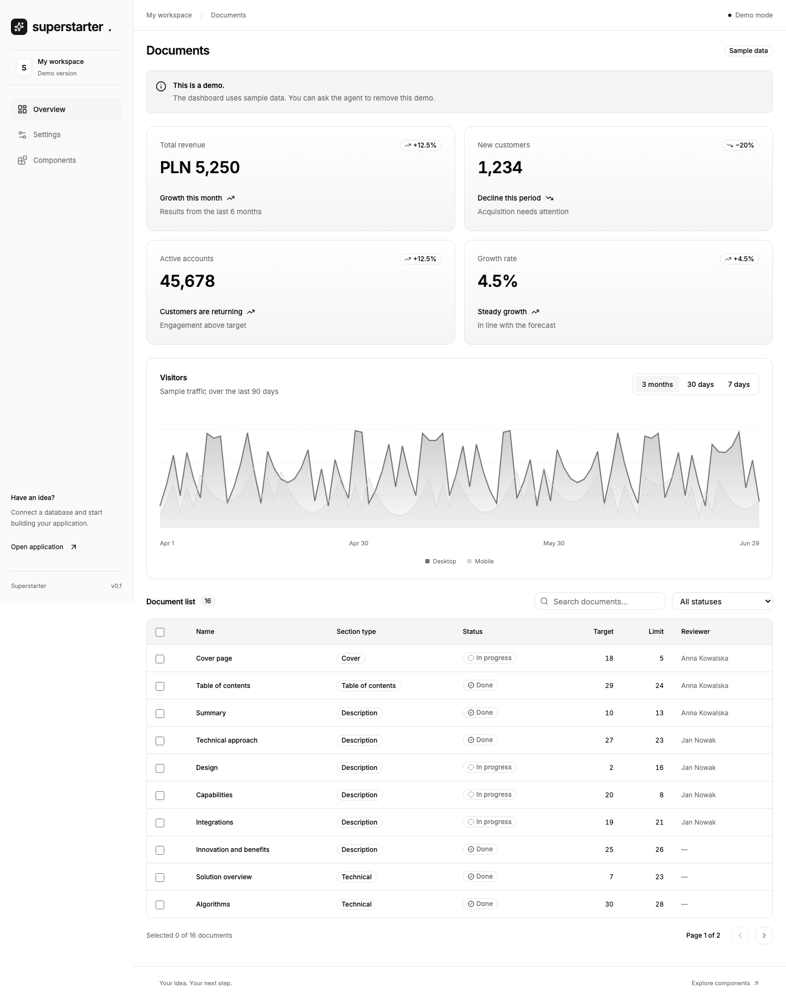

# Superstarter


An application starter for working with Codex: Next.js, shadcn/ui on Base UI, Supabase Auth, and automated quality checks.

## Demo preview



## Getting started

Node.js 24 and npm:

```sh
npm ci
npm run dev
```

Open [localhost:3000/demo](http://localhost:3000/demo). The demo runs without secrets, Supabase, or Docker. It includes a dashboard with metric cards, a chart, and a document table, inspired by [shadcn/ui dashboard-01](https://ui.shadcn.com/blocks). Data is static; filters, selection, and pagination use in-memory page state.

## What's included

- Next.js App Router, React, TypeScript, and npm with `package-lock.json`.
- shadcn/ui on Base UI with the b0 preset: Nova, Neutral, local Inter, and Lucide; Tailwind CSS.
- Light, dark, and system themes, responsive navigation, and a `/components` gallery with a React Hook Form and Zod example.
- A separate `/app` with Supabase Auth: sign-up, email confirmation, sign-in, password recovery, and sign-out.
- Vitest, Playwright, and GitHub Actions configuration.

The starter does not include domain tables, project migrations, or CRUD. After sign-in, `/app` shows the same sample dashboard; demo data is never sent to Supabase. Missing or failed configuration never switches the application to demo mode.

## Development

Features live in `src/features`, shared components in `src/components`, and tokens in `tokens.css`. All repository content, UI text, documentation, comments, and commit messages must be in English. See `AGENTS.md` for development rules.

`npm run format` formats the code. `npm run check` verifies formatting, lint, types, unit tests, the production build, and demo E2E tests. Auth integration tests require local Supabase running in Docker. After publishing the repository, configure required CI checks and hosting.

- [Supabase setup and auth tests](docs/supabase.md)
- [Deployment on Vercel](docs/deployment.md)
- [Architecture and adding features](docs/architecture.md)
